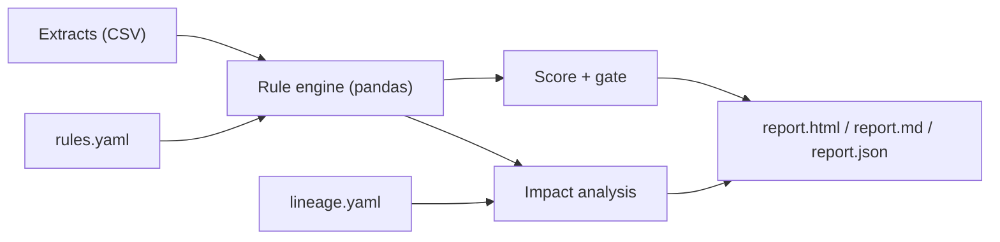

# bw-data-quality-lineage

Data quality checks and field-level lineage for SAP BW style extracts. It answers two questions that come up in every BW/4HANA project:

1. **Is the data that lands in the DataStore (DSO/ADSO) good?** Rules check keys, mandatory fields, master data references, value ranges, dates and formats.
2. **If it is not, who gets hurt?** The tool follows the failed field through the data flow (DataStore, reporting cube, BW queries, SAPUI5 apps) and lists every object that consumes the bad data.

The sample data is synthetic: 606 sales document items with defects planted on purpose. The tests check that the rules find exactly the planted defects.

## How it works



- `bwdq/rules.py` loads the extracts as text (so leading zeros and formats are kept) and evaluates the rules.
- `bwdq/lineage.py` holds the data flow as a graph. Edges carry a field map, for example `CUSTOMER -> 0CUSTOMER`, so impact is traced per field, not just per object.
- `bwdq/report.py` writes a self-contained HTML dashboard, a Markdown report with a Mermaid lineage diagram, and JSON for other tools.
- `bwdq/cli.py` is the command line. Exit code 0 = gate passed, 1 = gate failed, 2 = bad configuration. That makes it usable as a CI step or a check after a process chain.

## Run it

Python 3.10 or newer.

```bash
pip install -r requirements.txt
python -m bwdq run --out report
python -m pytest -q
```

Or with Docker:

```bash
docker build -t bwdq .
docker run --rm -v "$PWD/report:/out" bwdq
```

Open `report/report.html`. A finished example run is in [`docs/sample/`](docs/sample/) ([Markdown report](docs/sample/report.md)).

Regenerate the sample extracts with `python scripts/generate_data.py`.

## Rules

Rules live in `config/rules.yaml`. Every rule has an `id`, a `dataset`, a `type` and a `severity` (`error` or `warning`).

| Type | Fails when |
|---|---|
| `not_null` | the field is empty |
| `unique` | the key (one or more fields) appears more than once. All copies are flagged |
| `allowed_values` | a filled value is not in `values` |
| `regex` | a filled value does not match `pattern` completely |
| `range` | a filled value is not a number, or is outside `min` / `max` |
| `date_not_future` | a date (`%Y%m%d` by default) is invalid or after `as_of` |
| `reference` | a filled value is missing from another dataset's field (master data check) |
| `row_count` | the dataset has fewer than `min` rows |

Scoring: the quality score is the weighted mean of the rule pass rates (errors count 3, warnings 1). The gate fails when the score is below `threshold` **or** when an error rule fails above its `tolerance_pct` (default 0). The second condition matters: a 98 percent score can still hide a broken key.

## Lineage and impact

`config/lineage.yaml` describes the flow `DataSource -> ADSO -> reporting ADSO -> BW queries -> SAPUI5 apps`, plus master data. For a failed rule on `ZSD_O01.CUSTOMER` the report shows:

```
R003 (ZSD_O01.CUSTOMER): ADSO ZSD_C01 (reporting), Query Customers by country, SAPUI5 Customer Insights
```

A field that no query reads (`COMP_CODE`) stops at the reporting ADSO. A duplicate key has no single field, so it reaches everything downstream.

## Project layout

```
bwdq/          rule engine, lineage graph, reports, CLI
config/        rules.yaml, lineage.yaml
data/          sample extracts and planted_defects.json
scripts/       generate_data.py
tests/         23 pytest tests
docs/sample/   example report output
```

## Limits

- Works on CSV extracts. In a real landscape you would export from BW (open hub, ODP) or point `load_tables` at a database connection.
- The lineage is described by hand in YAML. It does not read BW metadata tables such as RSTRAN yet; that would be the next step.
- Rules run in memory with pandas, which is fine for millions of rows but not for very large extracts. The same rule definitions could be pushed down to SQL or Spark.
