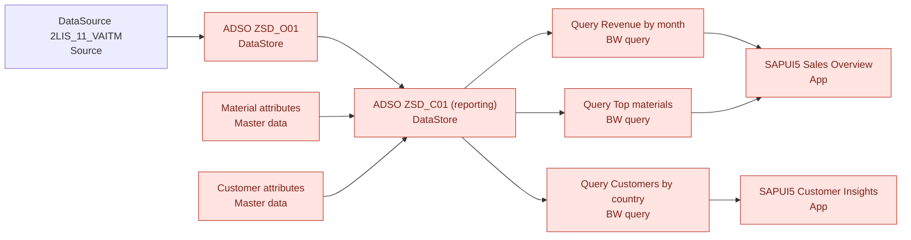

# Data quality report

**Score 98.62 / 100** (gate FAIL, threshold 90). 10 of 14 rules failed (8 errors, 2 warnings). Blocking rules: R002, R003, R004, R006, R007, R008, R009, R014.

## Rules

| Rule | Dataset | Field | Severity | Checked | Failed | Pass rate | Description |
|---|---|---|---|---:|---:|---:|---|
| R001 | ZSD_O01 | - | error | 1 | 0 | 100.0% | Extract is not empty |
| R002 | ZSD_O01 | DOC_NUMBER,DOC_ITEM | error | 606 | 12 | 98.0% | Document item is unique |
| R003 | ZSD_O01 | CUSTOMER | error | 606 | 14 | 97.7% | Customer is filled |
| R004 | ZSD_O01 | MATERIAL | error | 606 | 12 | 98.0% | Material exists in master data |
| R005 | ZSD_O01 | CUSTOMER | error | 592 | 0 | 100.0% | Customer exists in master data |
| R006 | ZSD_O01 | QUANTITY | error | 606 | 8 | 98.7% | Quantity is positive |
| R007 | ZSD_O01 | CALDAY | error | 606 | 6 | 99.0% | Posting date is not in the future |
| R008 | ZSD_O01 | CURRENCY | error | 606 | 7 | 98.8% | Currency is a valid ISO code in scope |
| R009 | ZSD_O01 | UNIT | error | 606 | 5 | 99.2% | Unit of measure is valid |
| R010 | ZSD_O01 | NET_VALUE | warning | 606 | 4 | 99.3% | Net value is plausible (0 to 100,000) |
| R011 | ZSD_O01 | DOC_NUMBER | error | 606 | 0 | 100.0% | Document number has 10 digits |
| R012 | MAT_ATTR | MATL_GROUP | warning | 60 | 3 | 95.0% | Material group is maintained |
| R013 | MAT_ATTR | MATERIAL | error | 60 | 0 | 100.0% | Material master key is unique |
| R014 | CUST_ATTR | COUNTRY | error | 40 | 2 | 95.0% | Country is a 2 letter code |

## Downstream impact

- **R002** (ZSD_O01.DOC_NUMBER,DOC_ITEM): ADSO ZSD_C01 (reporting), Query Revenue by month, Query Top materials, Query Customers by country, SAPUI5 Sales Overview, SAPUI5 Customer Insights
- **R003** (ZSD_O01.CUSTOMER): ADSO ZSD_C01 (reporting), Query Customers by country, SAPUI5 Customer Insights
- **R004** (ZSD_O01.MATERIAL): ADSO ZSD_C01 (reporting), Query Top materials, SAPUI5 Sales Overview
- **R006** (ZSD_O01.QUANTITY): ADSO ZSD_C01 (reporting), Query Top materials, SAPUI5 Sales Overview
- **R007** (ZSD_O01.CALDAY): ADSO ZSD_C01 (reporting), Query Revenue by month, SAPUI5 Sales Overview
- **R008** (ZSD_O01.CURRENCY): ADSO ZSD_C01 (reporting), Query Revenue by month, SAPUI5 Sales Overview
- **R009** (ZSD_O01.UNIT): ADSO ZSD_C01 (reporting)
- **R010** (ZSD_O01.NET_VALUE): ADSO ZSD_C01 (reporting), Query Revenue by month, Query Top materials, Query Customers by country, SAPUI5 Sales Overview, SAPUI5 Customer Insights
- **R012** (MAT_ATTR.MATL_GROUP): ADSO ZSD_C01 (reporting), Query Top materials, SAPUI5 Sales Overview
- **R014** (CUST_ATTR.COUNTRY): ADSO ZSD_C01 (reporting), Query Customers by country, SAPUI5 Customer Insights

## Lineage

